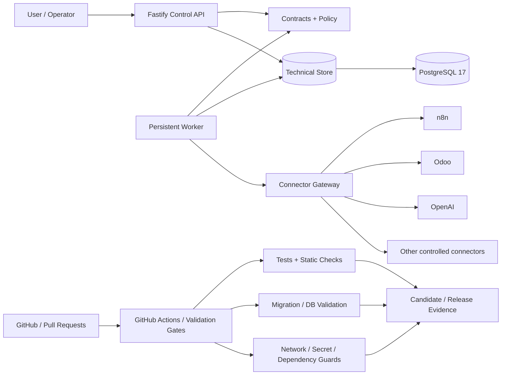

# CIRO Business OS / CIRO Control — Architecture Overview

This is a public, high-level architecture summary of work maintained in private repositories.

No production credentials, private source code or sensitive business data are included here.

## High-level architecture

## Design goals

The project is structured around a few principles:

- explicit contracts between components
- separation between HTTP handling and worker execution
- controlled connector boundaries
- least-privilege data access
- deterministic test environments
- fail-closed validation before promotion
- reproducible Git and GitHub evidence

## Control API

The CIRO Control D1 candidate uses:

- Node.js 24 LTS
- TypeScript 5.9.3
- Fastify 5.12.4
- JSON Schema 2020-12

The HTTP layer is intentionally separated from provider adapters. Request handling creates technical state and does not directly dispatch external provider calls.

## Worker and connector boundary

The worker operates against abstract ports and a controlled gateway.

The gateway is designed as the only adapter boundary, which makes it possible to:

- test orchestration without real provider calls
- block unintended network access
- use deterministic fake adapters
- keep credentials outside the application logic
- validate behaviour before enabling real integrations

## Data layer

The wider project includes work with PostgreSQL 17 covering:

- schema migrations
- migration runner validation
- database roles
- privilege checks
- row-level security concepts
- deterministic fixtures
- backup / restore verification

## Validation workflow

The project uses staged validation rather than treating a successful build as sufficient proof.

Typical gates include:

1. source and contract checks
2. TypeScript strict validation
3. focused tests
4. database migration/runtime checks
5. security and network guards
6. candidate generation
7. hosted validation where required
8. explicit acceptance / promotion

The accepted contract and policy foundation recorded **124/124 passing tests**.

The isolated CIRO Control D1 candidate includes a **44-case test matrix** plus static dependency, network and secret checks.

## GitHub workflow

The project is developed through a structured GitHub process using:

- dedicated branches
- pull requests
- commit and tree verification
- GitHub Actions
- temporary validation workflows when required
- regression and closure receipts
- explicit promotion gates

This workflow has given me practical experience with debugging CI failures, isolating regressions, reviewing logs and applying small targeted repairs without broadening the scope of a change.

## Integrations

The wider project ecosystem includes work involving:

- GitHub
- Netlify
- n8n
- Odoo
- OpenAI

The public documentation intentionally describes the integration boundaries without publishing private implementation details.

## Related public evidence

- [Technical Evidence Map](./TECHNICAL-EVIDENCE.md)
- [CIRO Business OS / CIRO Control case study](./CASE-STUDY-CIRO-BUSINESS-OS.md)
- [Accessibility Scanner Cloud](https://github.com/cirochiado/accessibility-scanner-cloud)
- [Portfolio](https://webdeveloperciro.com)
