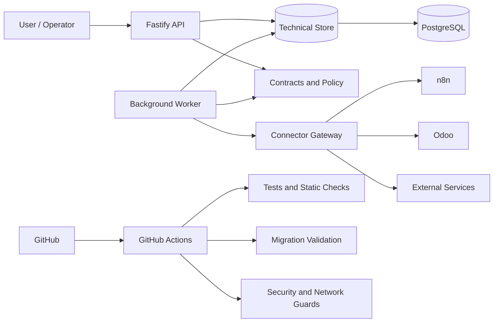

# Architecture

## Main boundaries

### API

Handles requests and creates technical state without directly calling external providers.

### Worker

Processes queued work independently from the HTTP layer.

### Connector gateway

Keeps provider-specific logic behind one controlled boundary. This makes integrations easier to test and prevents application code from depending directly on provider credentials.

### PostgreSQL

Stores application state and supports schema migrations, role separation and privilege validation.

### CI/CD

GitHub Actions runs automated checks for application code, database changes and security-related constraints before a change is accepted.
